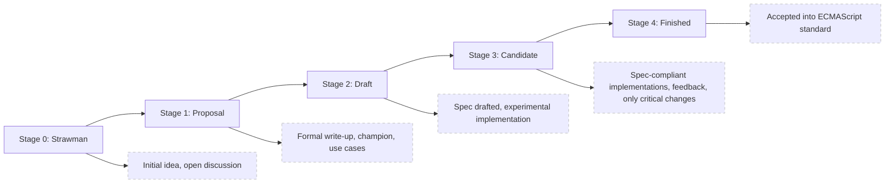
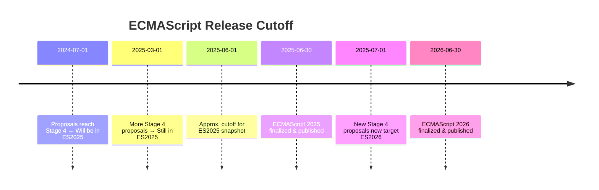

# EcmaScript stage process

```mermaid {scale: 0.5, alt: 'A simple sequence diagram'}
flowchart LR
    A[Stage 0: Strawman] --> B[Stage 1: Proposal]
    B --> C[Stage 2: Draft]
    C --> D[Stage 3: Candidate]
    D --> E[Stage 4: Finished]

    A_desc[Initial idea, open discussion] 
    B_desc[Formal write-up, champion, use cases]
    C_desc[Spec drafted, experimental implementation]
    D_desc[Spec-compliant implementations, feedback, only critical changes]
    E_desc[Accepted into ECMAScript standard]

    A --> A_desc
    B --> B_desc
    C --> C_desc
    D --> D_desc
    E --> E_desc

    classDef desc stroke:#bbb,stroke-dasharray: 5 5;
    class A_desc,B_desc,C_desc,D_desc,E_desc desc;

```

---
# Cutoff dates

```mermaid
timeline
    title ECMAScript Release Cutoff

    2024-07-01 : Proposals reach Stage 4 → Will be in ES2025
    2025-03-01 : More Stage 4 proposals → Still in ES2025
    2025-06-01 : Approx. cutoff for ES2025 snapshot
    2025-06-30 : ECMAScript 2025 finalized & published
    2025-07-01 : New Stage 4 proposals now target ES2026
    2026-06-30 : ECMAScript 2026 finalized & published

```
<!--

In practice this means that ~6 months ago ES25 was finalized and ES26 is still being finalized

-->