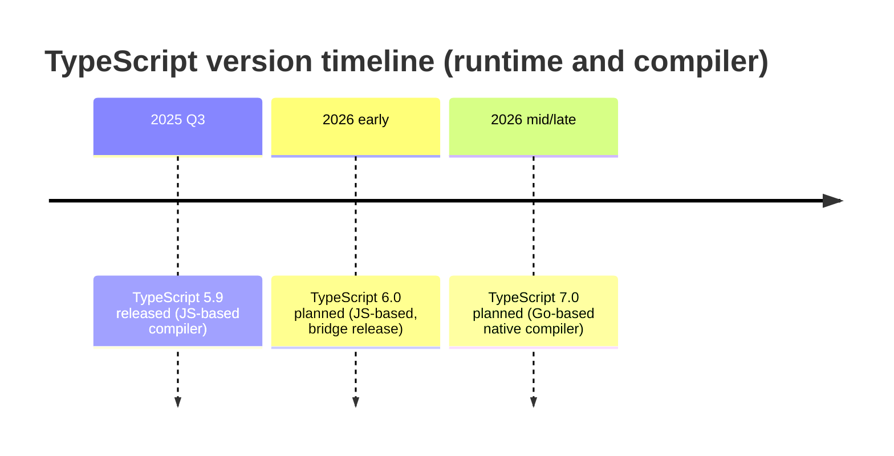

# Typescript 5.5 - 5.9

## Most impactful features

- Smarter type narrowing (5.5-5.6)
- Modern JS alignment (5.7-5.9)
- Better DX and Perf (5.6-5.9)

---

# Smarter Type Narrowing

```ts
// TS 5.5: Inferred predicates - no "v is string" boilerplate needed
const mixed: (string | number)[] = ["a", 1, "b"];
const strings = mixed.filter(v => typeof v === "string"); // Knows it's string[]

// TS 5.6: Catches obviously wrong checks
if (value && value == null) { // ⚠️ TS flags: "This is always false"
  // unreachable code
}

```

---

# Modern JS alignment (5.7-5.9)
```ts
// TS 5.7: `--target es2024` means TS auto-supports ES2025 features
// You get type safety for JSON imports, Set methods, iterator helpers
// without waiting for TS releases to "catch up"

import config from './config.json' with { type: 'json' }; // ✅ Typed

const a = new Set([1, 2, 3]);
const union = a.union(new Set([3, 4])); // ✅ TS knows return type

// TS 5.9: `import defer` - load modules when needed
import defer * as HeavyLib from './big-module';

if (userNeedsFeature) {
  const { expensiveFunction } = await HeavyLib;
  expensiveFunction();
}
```

---

# Better DX and Perf (5.6 - 5.9)
```ts
// TS 5.9: Smarter `tsc --init` - modern strict defaults out of the box
// No more "add noImplicitAny, add strictNullChecks..." by hand

// TS 5.6: Region-prioritized diagnostics
// Errors squiggle near your cursor first, not the end of the file
// Big files = snappier editor response

```

- combined these give 10-20% faster operations in many codebases
- 2x speedups in some `transpileModule`/`transpileDeclaration` scenarios

---

# What about the Go port

- There is a go port of the compilers in progress, but these perf wins are from optimizations of the existing implementation

